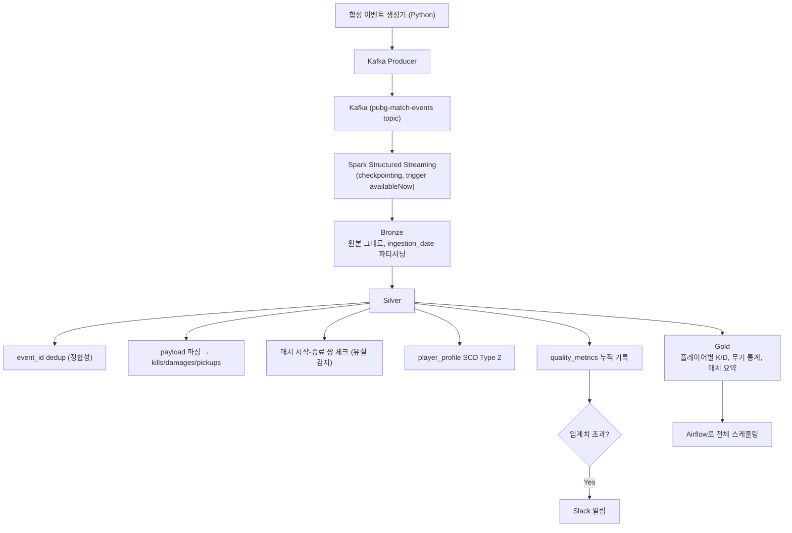

# 게임 매치 이벤트 로그 파이프라인 (Game Telemetry Pipeline)

## 프로젝트 목적
실무 데이터 파이프라인 구조(Kafka → Spark → Medallion Architecture → Airflow)를
로컬 환경(Docker Compose)에서 최대한 비슷하게 재현하는 것이 목표.

단순히 각 기술을 따로 써보는 게 아니라, **왜 이런 구조로 설계했는지**를
설명할 수 있는 것이 이 프로젝트의 핵심 가치임.

---

## Quick Start

```bash
# 1. Kafka + Kafka UI 실행
docker compose up -d

# 2. 상태 확인
docker compose ps

# (이후 단계는 각 스크립트 완성 시 이 섹션에 추가 예정)
```

- Kafka UI: http://localhost:8080

---

## 다루는 데이터: 합성 게임 매치 이벤트 로그

PUBG 공식 개발자 API(`documentation.pubg.com`)의 실제 텔레메트리 스펙을 참고해서
설계한 합성(synthetic) 게임 이벤트 로그. 실제 API를 실시간으로 호출하는 대신,
직접 대량 생성한다 (근거 조사용으로 실제 API를 호출해본 스크립트는
`scripts/inspect_pubg_telemetry.py`에 남겨둠).

다루는 이벤트 타입 (5종으로 한정, 위치 이동 로그처럼 매치당 수만 건 나오는
고빈도 이벤트는 제외):
- `LogMatchStart`, `LogMatchEnd`: 매치 시작/종료
- `LogPlayerKillV2`: 킬
- `LogPlayerTakeDamage`: 데미지
- `LogItemPickup`: 아이템 습득

### 스키마: 봉투(envelope) + payload 구조
실제 텔레메트리는 이벤트 타입마다 필드가 전혀 달라서(킬은 가해자/무기,
아이템은 아이템명), 하나의 고정 스키마로 억지로 합치지 않는다.

```json
{
  "event_id": "string (UUID, 중복 감지용)",
  "event_type": "string (LogMatchStart | LogMatchEnd | LogPlayerKillV2 | LogPlayerTakeDamage | LogItemPickup)",
  "match_id": "string",
  "event_time": "ISO8601 string",
  "payload": "JSON string (이벤트 타입별 상세 필드)"
}
```

Bronze는 이 구조를 그대로 저장하고, `payload` 파싱은 Silver에서 이벤트
타입별로 한다. 이렇게 하면 이벤트 타입이 늘어나도 Bronze 스키마는 안정적이다.

### 의도적으로 반영한 실무형 데이터 문제
- 동일 `event_id` 중복 발생 (네트워크 재전송/재시도 재현)
- 일부 매치는 `LogMatchStart`만 있고 `LogMatchEnd`가 없음 (매치 로그
  유실 재현 → Silver의 유실 감지 체크 대상)
- 일부 이벤트에 `account_id` 결측

### 플레이어 프로필 (SCD Type 2 대상)
매치 이벤트와는 별개로, 시즌이 지나면서 랭크/티어가 바뀌는 `player_profile`
차원 테이블을 시즌별 스냅샷으로 생성. Silver에서 SCD Type 2(이력 유지:
`valid_from`/`valid_to`/`is_current`)로 병합한다.

---

## 목표 아키텍처



---

## 기술 스택
- Python 3.11+
- Apache Kafka (Docker Compose, KRaft 모드, 단일 브로커)
- PySpark (Structured Streaming + 배치 처리)
- Parquet (Bronze/Silver/Gold 저장 포맷, 추후 Delta Lake로 전환 검토)
- Apache Airflow (오케스트레이션)
- Slack Incoming Webhook (품질 이상 알림)
- Docker / Docker Compose

---

## 현재까지 진행 상황
- [x] 프로젝트 기획 및 스키마 설계
- [x] `docker-compose.yml` (Kafka KRaft + Kafka UI)
- [x] `scripts/inspect_pubg_telemetry.py` — 실제 API로 텔레메트리 구조 확인
- [ ] 합성 이벤트 생성기
- [ ] Kafka Producer
- [ ] Spark Structured Streaming Consumer → Bronze
- [ ] Silver 변환 (파싱/정합성/유실감지/SCD/품질지표)
- [ ] Gold 집계
- [ ] Airflow DAG + Slack 알림
- [ ] 트레이드오프/설계 의도 문서화

---

## 설계 원칙
- 각 단계는 독립적으로 실행 테스트 가능해야 함 (전체를 한 번에 안 돌려도
  Bronze만, Silver만 따로 테스트 가능하게).
- 코드에 주석으로 "왜 이렇게 설계했는지" 설명을 남길 것.
- 과도한 엔지니어링 지양: 로컬 개인 프로젝트 수준에 맞는 간결한 구현 우선.
